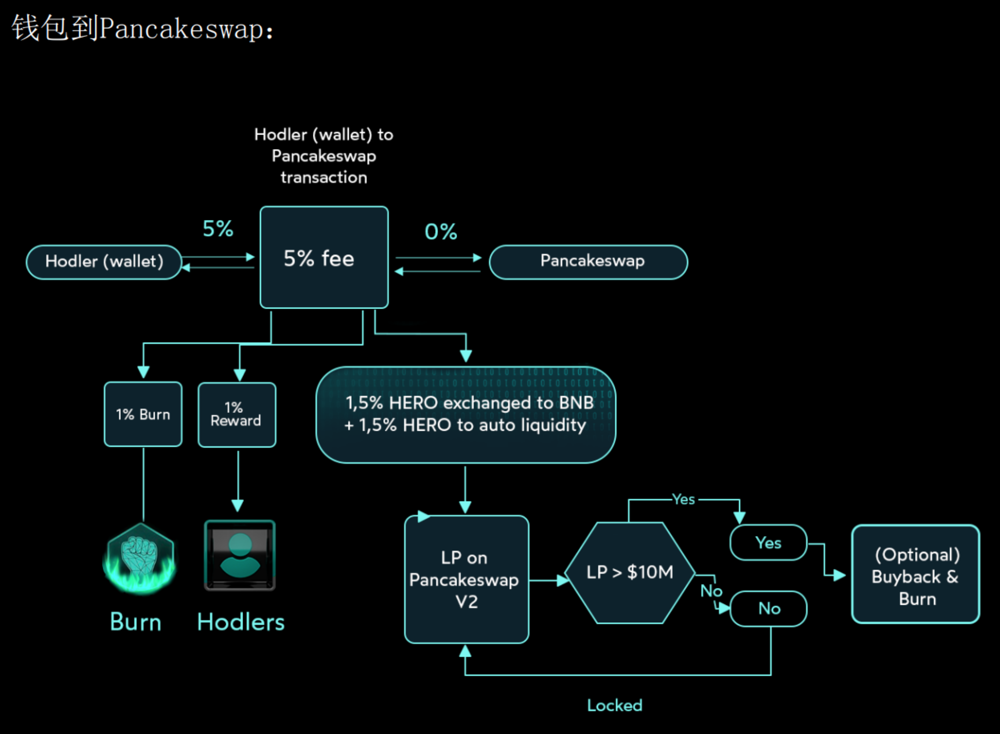
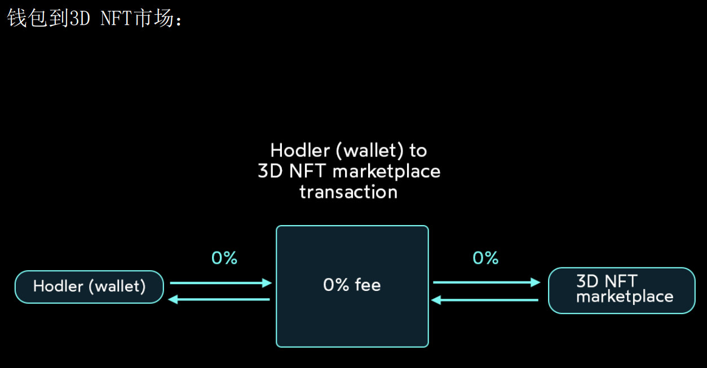
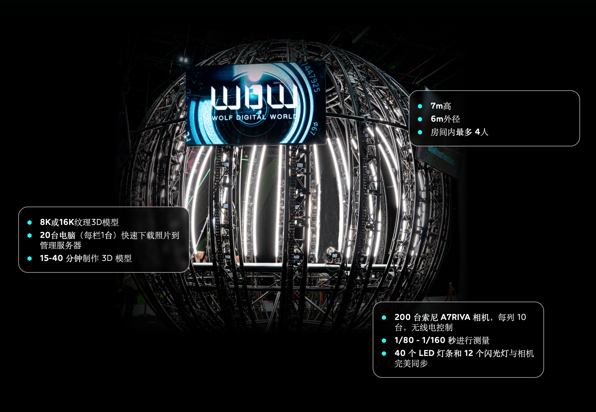

# Metahero项目分析

## 找消息

## 筛选项目

### 工具筛选

数据可以作为一个参考标准，但不是唯一，因为数据也可能造假。

#### [dappradar](https://dappradar.com/)

无

#### [dapp.com](https://www.dapp.com/)

无

#### [defillama](https://defillama.com/)

#### [tokenterminal](https://www.tokenterminal.com/)

### 筛选标准：黄金四角

- 资方：至少1个靠谱的资方
- 团队：成员背景好，有相关从业经历
- 产品：产品体验好，赛道有前景且白皮书清晰
- Token：代币经济模型

以上是比较重要的几个指标，当然也不一定全部都能满足，可以用雷达图来表示。

#### 资方

##### [block123](https://www.block123.com/)

block123是一个查看投资方信息的工具网站。

##### 资方官网

- 创始人
- 过往项目

#### Token状况

Symbel：HERO

合约地址：

- BSC：0xD40bEDb44C081D2935eebA6eF5a3c8A31A1bBE13
- ETH：暂无

| 基本数据 | value | 补充 |
| --- | --- | --- |
| 当前价格 | $0.119375 | --- |
| 总市值 | $611,397,943 | --- |
| 总供应量 | 9,766,213,274 | --- |
| 流通供应量 | 5,120,918,288 | 占比 52.4% |

##### Token运作模式

钱包到钱包：

- 买卖双方各收5%手续费，总共10%手续费
- 手续费的2%烧毁
- 手续费的2%奖励给持有者
- 手续费的6%用来在pancake上提供流动性，流动性大于10M，则进行回购或者烧毁

具体流程图：

钱包到Pancake：

钱包到NFT市场：

### 其他更全面的信息

#### 竞争对手情况

#### 该项目的优劣势

#### 赛道发展前景及周期

#### 代码审计/更新情况

### 项目基本信息

#### 网站链接

官网：<https://metahero.io/>

Github地址: <https://github.com/metahero-io>

#### 项目是什么概念的？什么板块的？

Metaverse板块 Hardware Marketplace VR/AR

#### 项目简介，大概是做什么的？

元宇宙的入口

使用3D扫描技术打通元宇宙和现实世界。与 3D 扫描和建模领域的全球领导者 Wolf Digital World (WDW) 合作。为 Metaverse、游戏、社交、时尚和扫描艺术品创建头像以创建 NFT。

WDW的技术：

#### 项目的进度和路线图？

**已经达成的**：

- HERO应用程序，目前只能看一些HERO代币的信息和项目新闻

**未来计划**：

- 更新网站到V2
- 进一步在CEX上市
- 开发项目专属的NFT市场
- 安装公共的3D扫描密室
- APP升级到V2

#### 项目团队概况

实名团队，可以找到领英链接

#### 社区活跃度

- Twitter粉丝数：13.6万
- 推文活跃度：
  - 平均评论数100+
  - 平均点赞数1500+
  - 平均转推数500+
- TG人数3.6万
- Youtube的视频平均播放量2w+

#### 当前Top交易所

- 去中心化：pancake
- 中心化：Kucoin

### 其余工具

nansen、theblock、debank等工具
链闻、深潮、Messari等平台的价值信息。
Coindesk、Decrypt等资讯平台

