# MySQL笔记

## 安装Mysql

### Ubuntu18.04

请按照如下链接操作：[学习链接：安装MySQL](<https://www.cnblogs.com/opsprobe/p/9126864.html>)


### Windows

双击安装程序，先跟着提示走，有需要特别解释的步骤会单独出来说。


MySQL会有许多组件，安装时需要选择安装的组件：

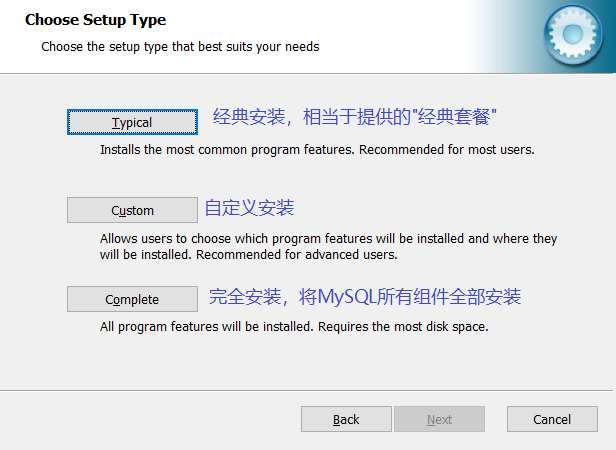

这里我们选择自定义安装。


点击安装后，安装完成会弹出如下页面：


这只是一个广告页面，介绍MySQL有多么多么好。


接下来就会弹出配置 MySQL 的页面：

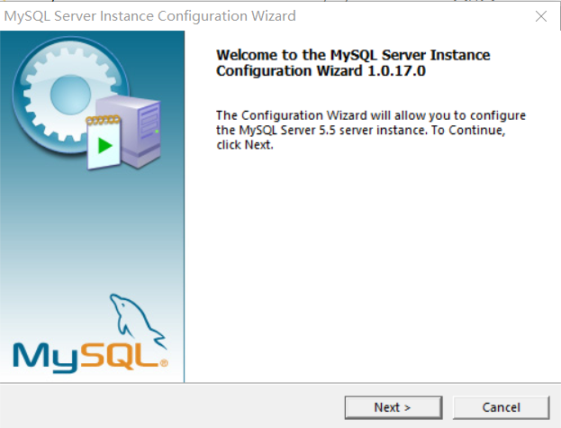

这个页面也可以在安装MySQL的路径中找到对应的打开程序：

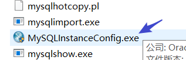

在安装路径的bin目录下找到此应用程序，即可再次打开 MySQL的配置界面。


这里选择精确配置：

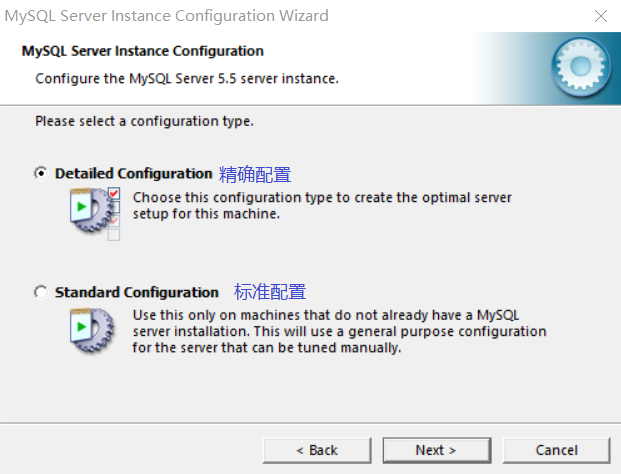


选择多功能型数据库，无论事务还是非事务都适用：

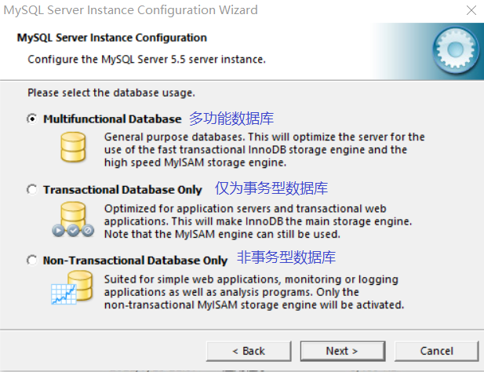


并发连接数选择20就可以：

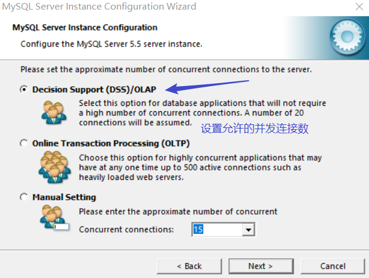


生产环境中最好修改端口号，避免遭到攻击：

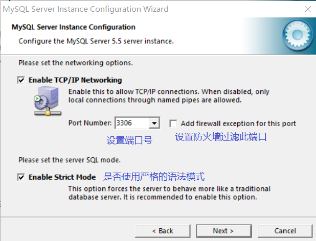


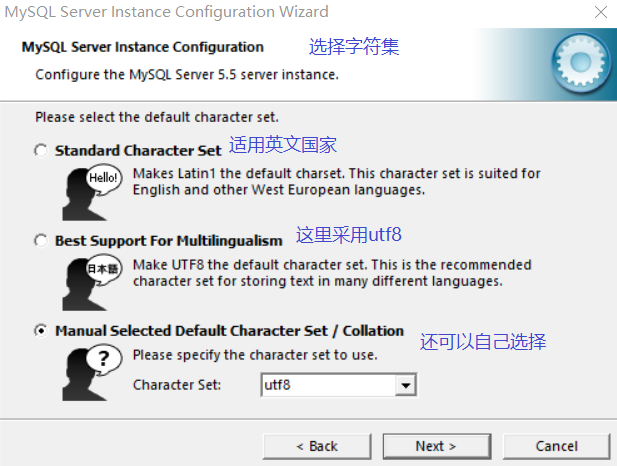

为了使用的灵活性，这里选择自定义


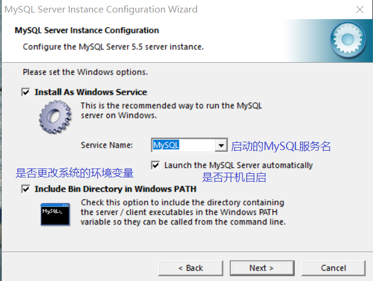


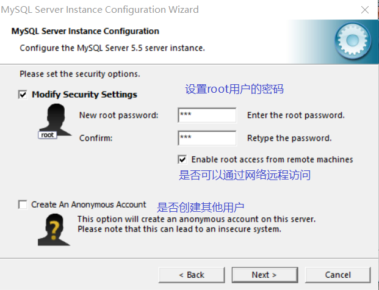


最后恭喜，完成安装！！


## 配置文件讲解

再MySQL的安装路径下，有一个名为`my.ini`的文件，这里面就有关于MySQL的配置。如果想修改配置，可以直接修改这个文件。


## 数据库表的设计

- 设计表的时候，表之间的关联字段类型尽量设置成一样


## 语句

### SQL分类

DDL（data definition language）数据库定义语言CREATE、ALTER、DROP、SHOW

DML（data manipulation language）数据操纵语言SELECT、UPDATE、INSERT、DELETE

DCL（Data Control Language）数据库控制语言,是用来设置或更改数据库用户或角色权限的语句

### MySQL服务器操作

#### 连接MySQL服务器

```shell
mysql -h 127.0.0.1 -P 3306 -u root -p123

host：主机ip			 -h
port：端口号			-P（大写的P）
username：用户名		-u
password：密码			 -p（小写的p）
```

**注意：**

- -p后边不要有空格，不然不能识别为密码；系统会将123识别为数据库名，并且需要再次输入密码。
- 如果MySQL服务器在本地，IP地址可以省略。
- 如果MySQL服务器用的是3306端口，-P也是可以省略。


#### 查看MySQL服务器版本

##### 数据库外部查看

```shell
mysql -V
```


##### 登录数据库时查看

例码：

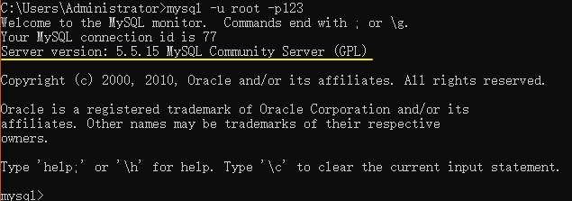


##### 使用系统函数查看mysql数据库版本

```sql
mysql> select version();
或
mysql> select @@version;
```


##### 使用status命令查看


### 数据库中解决乱码问题

#### 出现乱码的真实情况

数据库字符优先级有：系统级、数据库级、表级、字段。这5个优先级中字段优先级最高。

举个列子：我们要向表中存储中文数据，如果表的字符编码是utf8，而字段的字符编码是latin1，那么还是会出现乱码。因为字段的优先级最高

#### 具体操作

查看表中所有字段的字符编码：

```sql
show full columns from student; // student是表名
```

查看表的字符编码：

```sql
show create table student;
```

查看数据库的字符编码：

```sql
show create database student; // 这里student是数据库名
```

修改数据库字符编码：

```sql
alter database student charset=utf8;
```

修改表的字符编码：

```sql
alter table student charset=utf8;
```

修改表中所有字段的字符编码：

​		此命令同时也会将表的字符编码修改

```sql
alter table student convert to character set utf8;
```


#### 另一种乱码情况

服务端和客户端编码格式不同，导致的乱码。通常在 insert 的时候插入中文报错。

例如我们用cmd来操作MySQL时，命令行就是一个客户端，打开cmd的属性可以看到编码格式为 GBK：


但是通过命令 `show variables like '%char%';` 可以看到MySQL服务器解释 client 命令时采用的编码格式为：utf8；看下图：


**要想插入时不报错和查询时不出现乱码，就必须让服务端和客户端的编码格式一致**

##### 实际操作

分别更改服务端与客户端交互的编码格式：

```shell
set character_set_client=gbk;
set character_set_results=gbk;
```


### 数据库层面操作

#### 显示数据库

```
mysql> show databases;
```

安装MySQL后，MySQL自带了4个数据库

1. information_schema：存储了MySQL服务器管理数据库的信息。
2. performance_schema：MySQL5.5新增的表，用来保存数据库服务器性能的参数
3. mysql：MySQL系统数据库，保存的登录用户名，密码，以及每个用户的权限等等
4. test：给用户学习和测试的数据库。


#### 创建数据库

```mysql
语法：create database [if not exists] `数据名` [字符编码]
```

创建数据库：

```mysql
mysql> create database stu;
Query OK, 1 row affected (0.09 sec)
```

如果创建的数据库已存在，就会报错

```mysql
mysql> create database stu;
ERROR 1007 (HY000): Can't create database 'stu'; database exists
```

解决：创建数据库的时候判断一下数据库是否存在，如果不存在再创建

```mysql
mysql> create database if not exists stu;
Query OK, 1 row affected, 1 warning (0.00 sec)
```

如果数据库名是关键字和特殊字符要报错

 解决：在特殊字符、关键字行加上反引号

```mysql
mysql> create database `create`;
Query OK, 1 row affected (0.05 sec)
```

```php
多学一招：为了创建数据库时万无一失，我们可以在所有的数据库名上加上反引号
```

创建数据库的时候可以指定字符编码

```mysql
mysql> create database teacher charset=gbk;
Query OK, 1 row affected (0.01 sec)
gbk		简体中文
gb2312：	简体中文
utf8：	通用字符编码
```

```php
脚下留心：创建数据库如果不指定字符编码，默认和MySQL服务器的字符编码是一致的。
```


#### 删除数据库

```mysql
语法：drop database [if exists] 数据库名
```

删除数据库

```mysql
mysql> drop database teacher;
Query OK, 0 rows affected (0.00 sec)
```

如果删除的数据库不存在，会报错

```mysql
mysql> drop database teacher;
ERROR 1008 (HY000): Can't drop database 'teacher'; database doesn't exist
mysql>
```

 解决：删除之前判断一下，如果存在就删除

```mysql
mysql> drop database if exists teacher;
Query OK, 0 rows affected, 1 warning (0.00 sec)
```


#### 显示创建数据库的SQL语句

这个命令有什么意义？**可以查看字符编码**

```mysql
语法：show create database 数据库名
```

```mysql
mysql> show create database stu;
+----------+--------------------------------------------------------------+
| Database | Create Database                                              |
+----------+--------------------------------------------------------------+
| stu      | CREATE DATABASE `stu` /*!40100 DEFAULT CHARACTER SET utf8 */ |
+----------+--------------------------------------------------------------+
1 row in set (0.01 sec)

mysql> show create database teacher;
+----------+-----------------------------------------------------------------+
| Database | Create Database                                                 |
+----------+-----------------------------------------------------------------+
| teacher  | CREATE DATABASE `teacher` /*!40100 DEFAULT CHARACTER SET gbk */ |
+----------+-----------------------------------------------------------------+
1 row in set (0.00 sec)
```


#### 修改数据库

修改数据库的字符编码

语法：

```mysql
alter database 数据库名 charset=字符编码
```

例题

```mysql
mysql> alter database teacher charset=utf8;
Query OK, 1 row affected (0.00 sec)

mysql> show create database teacher;
+----------+------------------------------------------------------------------+
| Database | Create Database                                                  |
+----------+------------------------------------------------------------------+
| teacher  | CREATE DATABASE `teacher` /*!40100 DEFAULT CHARACTER SET utf8 */ |
+----------+------------------------------------------------------------------+
1 row in set (0.00 sec)
```


#### 选择数据库

语法：

```mysql
use 数据库名;
```

选择数据库

```mysql
mysql> use stu;
Database changed
```

#### 导出数据库数据

```shell
mysqldump -u 用户名 -p 数据库名 > 文件名
```

回车后再输入密码


### 表的操作

#### 显示所有表

语法：

```mysql
show tables;
```


#### 创建表

语法：

```mysql
create table [if not exists] 表名(
    字段名 数据类型 [null|not null] [auto_increment] [primary key] [comment],
    字段名 数据类型 [default]…
)engine=存储引擎
```

单词

```mysql
null | not null   	空|非空  	# ‘非空’保证该字段值不为空
default	          	默认值		# 代表此字段默认的值是什么
auto_increment    	自动增长
primary key       	主键		# 保证该字段的值具有唯一性，并且非空
unique				唯一		 # 保证该字段的值具有唯一性，但可以为空
comment           	备注
engine           	引擎   innodb  myisam  memory  引擎是决定数据存储的方式
```

创建简单的表

```mysql
mysql> create database itcast;
Query OK, 1 row affected (0.00 sec)

mysql> use itcast;
Database changed
mysql> show tables;
Empty set (0.05 sec)

# 创建表
mysql> create table stu(
    -> id int,
    -> name varchar(30)
    -> );
Query OK, 0 rows affected (0.13 sec)
# 查看创建的表
mysql> show tables;
+------------------+
| Tables_in_itcast |
+------------------+
| stu              |
+------------------+
```

创建复杂的表

```mysql
mysql> set names gbk;   # 设置字符编码
Query OK, 0 rows affected (0.05 sec)

mysql> create table if not exists teacher(
    -> id int auto_increment primary key comment '主键',
    -> name varchar(20) not null comment '姓名',
    -> phone varchar(20) comment '电话号码',
    -> `add` varchar(100) default '地址不详' comment '地址'
    -> )engine=innodb;
Query OK, 0 rows affected (0.09 sec)
```

多学一招：create table 数据库名.表名，用于给指定的数据库创建表

```mysql
mysql> create table data.stu(  #给data数据库中创建stu表
    -> id int,
    -> name varchar(10));
Query OK, 0 rows affected (0.00 sec)
```


##### 创建表时容易出错的点

1. 忘记写表名
2. `UNSIGNED` 不能够写在 `DEFAULT` 的后边
3. 最后一字段行不要加逗号


#### 显示创建表的语句

语法：

```mysql
show create table 表名;
```

显示创建teacher表的语句

```mysql
mysql> show create table teacher;
+---------+--------------------------------------------------------------------------
-------------------------------------------------------------------------------------
-------------------------------------------------------------------------------------
-------+
| Table   | Create Table


       |
+---------+--------------------------------------------------------------------------
-------------------------------------------------------------------------------------
-------------------------------------------------------------------------------------
-------+
| teacher | CREATE TABLE `teacher` (
  `id` int(11) NOT NULL AUTO_INCREMENT COMMENT '主键',
  `name` varchar(20) NOT NULL COMMENT '姓名',
  `phone` varchar(20) DEFAULT NULL COMMENT '电话号码',
  `add` varchar(100) DEFAULT '地址不详' COMMENT '地址',
  PRIMARY KEY (`id`)
) ENGINE=InnoDB DEFAULT CHARSET=utf8                         |
```

将两个字段竖着排列          ` show create table 表名\G`

```mysql
mysql> show create table teacher\G;
*************************** 1. row ***************************
       Table: teacher
Create Table: CREATE TABLE `teacher` (
  `id` int(11) NOT NULL AUTO_INCREMENT COMMENT '主键',
  `name` varchar(20) NOT NULL COMMENT '姓名',
  `phone` varchar(20) DEFAULT NULL COMMENT '电话号码',
  `add` varchar(100) DEFAULT '地址不详' COMMENT '地址',
  PRIMARY KEY (`id`)
) ENGINE=InnoDB DEFAULT CHARSET=utf8
1 row in set (0.00 sec)
```


#### 查看表结构

语法：

```mysql
desc[ribe] 表名
```

查看teacher表的结构

```mysql
mysql> describe teacher;
+-------+--------------+------+-----+----------+----------------+
| Field | Type         | Null | Key | Default  | Extra          |
+-------+--------------+------+-----+----------+----------------+
| id    | int(11)      | NO   | PRI | NULL     | auto_increment |
| name  | varchar(20)  | NO   |     | NULL     |                |
| phone | varchar(20)  | YES  |     | NULL     |                |
| add   | varchar(100) | YES  |     | 地址不详        |                |
+-------+--------------+------+-----+----------+----------------+
4 rows in set (0.08 sec)

mysql> desc teacher;
+-------+--------------+------+-----+----------+----------------+
| Field | Type         | Null | Key | Default  | Extra          |
+-------+--------------+------+-----+----------+----------------+
| id    | int(11)      | NO   | PRI | NULL     | auto_increment |
| name  | varchar(20)  | NO   |     | NULL     |                |
| phone | varchar(20)  | YES  |     | NULL     |                |
| add   | varchar(100) | YES  |     | 地址不详        |                |
+-------+--------------+------+-----+----------+----------------+
4 rows in set (0.01 sec)
```


#### 删除表

语法：

```mysql
drop table [if exists] 表1，表2,… 
```

删除表

```mysql
mysql> drop table stu;
Query OK, 0 rows affected (0.08 sec)
```

如果删除一个不存在的表就会报错，删除的时候可以判断一下，存在就删除。

```mysql
mysql> drop table stu;
ERROR 1051 (42S02): Unknown table 'stu'

mysql> drop table if exists stu;
Query OK, 0 rows affected, 1 warning (0.00 sec)
```

可以一次删除多个表

```mysql
mysql> drop table a1,a2;
Query OK, 0 rows affected (0.00 sec)
```


#### 修改表

```mysql
语法：alter table 表名
```

1、添加字段：alter table 表名 add [column] 字段名 数据类型 [位置]

例题一：添加字段

```mysql
mysql> alter table teacher add age int;
Query OK, 0 rows affected (0.09 sec)
Records: 0  Duplicates: 0  Warnings: 0

mysql> desc teacher;
+-------+--------------+------+-----+----------+----------------+
| Field | Type         | Null | Key | Default  | Extra          |
+-------+--------------+------+-----+----------+----------------+
| id    | int(11)      | NO   | PRI | NULL     | auto_increment |
| name  | varchar(20)  | NO   |     | NULL     |                |
| phone | varchar(20)  | YES  |     | NULL     |                |
| add   | varchar(100) | YES  |     | 地址不详   |                |
| age   | int(11)      | YES  |     | NULL     |                |
+-------+--------------+------+-----+----------+----------------+
5 rows in set (0.00 sec)
```

例题二：在第一个位置上添加字段

```mysql
mysql> alter table teacher add email varchar(30) first;
Query OK, 0 rows affected (0.00 sec)
Records: 0  Duplicates: 0  Warnings: 0

mysql> desc teacher;
+-------+--------------+------+-----+----------+----------------+
| Field | Type         | Null | Key | Default  | Extra          |
+-------+--------------+------+-----+----------+----------------+
| email | varchar(30)  | YES  |     | NULL     |                |
| id    | int(11)      | NO   | PRI | NULL     | auto_increment |
| name  | varchar(20)  | NO   |     | NULL     |                |
| phone | varchar(20)  | YES  |     | NULL     |                |
| add   | varchar(100) | YES  |     | 地址不详        |                |
| age   | int(11)      | YES  |     | NULL     |                |
+-------+--------------+------+-----+----------+----------------+
```

例题三：在指定的字段后添加字段

```mysql
mysql> alter table teacher add sex varchar(2) after name;
Query OK, 0 rows affected (0.00 sec)
Records: 0  Duplicates: 0  Warnings: 0

mysql> desc teacher;
+-------+--------------+------+-----+----------+----------------+
| Field | Type         | Null | Key | Default  | Extra          |
+-------+--------------+------+-----+----------+----------------+
| email | varchar(30)  | YES  |     | NULL     |                |
| id    | int(11)      | NO   | PRI | NULL     | auto_increment |
| name  | varchar(20)  | NO   |     | NULL     |                |
| sex   | varchar(2)   | YES  |     | NULL     |                |
| phone | varchar(20)  | YES  |     | NULL     |                |
| add   | varchar(100) | YES  |     | 地址不详        |                |
| age   | int(11)      | YES  |     | NULL     |                |
+-------+--------------+------+-----+----------+----------------+
7 rows in set (0.00 sec)
```

2、删除字段：alter table 表 drop [column] 字段名

```mysql
mysql> alter table teacher drop email;
Query OK, 0 rows affected (0.06 sec)
Records: 0  Duplicates: 0  Warnings: 0
```

3、修改字段(改名改类型)：alter table 表 change [column] 原字段名 新字段名 数据类型 …

 将字段 sex 改为 xingbie，数据类型为int

```mysql
mysql> alter table teacher change sex xingbie int;
Query OK, 0 rows affected (0.00 sec)
Records: 0  Duplicates: 0  Warnings: 0
```

4、修改字段（不改名）: alter table 表 modify 字段名 字段属性 …

将性别的数据类型改为varchar(2)

```mysql
mysql> alter table teacher modify xingbie varchar(2);
Query OK, 0 rows affected (0.00 sec)
Records: 0  Duplicates: 0  Warnings: 0
```

5、修改引擎：alter table 表名 engine=引擎名

```mysql
mysql> alter table teacher engine=myisam;
Query OK, 0 rows affected (0.05 sec)
Records: 0  Duplicates: 0  Warnings: 0
```

6、修改表名：alter table 表名 rename to 新表名

```mysql
mysql> alter table teacher rename to stu;
Query OK, 0 rows affected (0.00 sec)

mysql> show tables;
+------------------+
| Tables_in_itcast |
+------------------+
| stu              |
+------------------+
1 row in set (0.00 sec)
```


#### 复制表

```mysql
语法一：create table 新表 select 字段 from 旧表
```

 特点：不能复制父表的主键，能够复制父表的数据

```mysql
mysql> create table stu1 select * from stu;
Query OK, 1 row affected (0.06 sec)
Records: 1  Duplicates: 0  Warnings: 0

mysql> select * from stu1;    # 查看数据复制到新表中
+----+------+------+-------+
| id | name | addr | score |
+----+------+------+-------+
|  1 | rose | 上海    |    88 |
+----+------+------+-------+
1 row in set (0.00 sec)

mysql> desc stu1;    #  主键没有复制
+-------+-------------+------+-----+----------+-------+
| Field | Type        | Null | Key | Default  | Extra |
+-------+-------------+------+-----+----------+-------+
| id    | int(11)     | NO   |     | 0        |       |
| name  | varchar(20) | NO   |     | NULL     |       |
| addr  | varchar(50) | YES  |     | 地址不详        |       |
| score | int(11)     | YES  |     | NULL     |       |
+-------+-------------+------+-----+----------+-------+
4 rows in set (0.00 sec)
```

```mysql
语法二：create table 新表 like 旧表
```

特点：只能复制表结构，不能复制表数据

```mysql
Query OK, 0 rows affected (0.00 sec)

mysql> select * from stu2;   # 数据没有复制
Empty set (0.01 sec)

mysql> desc stu2;   # 主键复制了
+-------+-------------+------+-----+----------+----------------+
| Field | Type        | Null | Key | Default  | Extra          |
+-------+-------------+------+-----+----------+----------------+
| id    | int(11)     | NO   | PRI | NULL     | auto_increment |
| name  | varchar(20) | NO   |     | NULL     |                |
| addr  | varchar(50) | YES  |     | 地址不详        |                |
| score | int(11)     | YES  |     | NULL     |                |
+-------+-------------+------+-----+----------+----------------+
4 rows in set (0.00 sec)
```


### 数据操作

#### 插入数据

##### 插入一条数据

```mysql
语法：insert into 表名 (字段名, 字段名,…) values (值1, 值1,…)
```

例题一：插入数据

TODO: 有插入中文失败待解决

```mysql
mysql> insert into stu (id,name,addr,score) values (1,'tom','上海',88);
Query OK, 1 row affected (0.11 sec)
```

例题二：插入的字段可以和表的字段顺序不一致。值的顺序必须和插入字段的顺序一致。

```mysql
mysql> insert into stu (name,score,addr,id) values ('berry',77,'北京',2);
Query OK, 1 row affected (0.00 sec)
```

例题三：可以插入部分字段，但是，非空字段必须插入

```mysql
mysql> insert into stu (id,name,addr) values (3,'ketty','上海');
```

例题四：自动增长字段不用插入，数据库会自动插入增长的数字

```mysql
mysql> insert into stu (name,addr) values ('rose','北京');
Query OK, 1 row affected (0.00 sec)
```

例题五：自动增长列的值插入null即可

```mysql
mysql> insert into stu (id,name,addr,score) values (null,'李白','上海',66);
Query OK, 1 row affected (0.00 sec)
```

例题六：插入值的顺序和个数与表字段的顺序和个数一致，插入的字段可以省略

```mysql
mysql> insert into stu values (null,'杜甫','北京',null);
Query OK, 1 row affected (0.00 sec)
```

例题七：通过default关键字插入默认值

```mysql
mysql> insert into stu values (null,'李清照',default,66);
```

```mysql
脚下留心：
1、插入字段的顺序与值的顺序必须一致
```

##### 插入多条数据

```mysql
mysql> insert into stu values (null,'辛弃疾',default,66),(null,'岳飞','河南',77);
Query OK, 2 rows affected (0.00 sec)
Records: 2  Duplicates: 0  Warnings: 0
```


#### 更新数据

语法：

```mysql
update 表名 set 字段=值 [where 条件] 
```

例题一：将1号学生的地址改成山东

```mysql
mysql> update stu set addr='山东' where id=1
```

例题二：将ketty的成绩改为99

```mysql
mysql> update stu set score=99 where name='ketty';
```

例题三：将berry地址改成上海，成绩改成66

```mysql
mysql> update stu set addr='上海',score=66 where name='berry';
```

例题四：将上海的学生成绩改为60

```mysql
mysql> update stu set score=60 where addr='上海';
```

例题五：条件可以省略，如果省略，更改所有数据（将所有数据的地址改为湖南，成绩改为70）

```mysql
mysql> update stu set addr='湖南',score=70;
```

例题六：将2、3的学生成绩改为65

```mysql
mysql> update stu set score=65 where id=2 or id=3;
```


#### 删除数据

语法

```mysql
delete from 表名 [where 条件] 
```

例题一：删除学号是1号的学生

```mysql
mysql> delete from stu where id=1;
```

例题二：删除成绩小于等于65分的

```mysql
mysql> delete from stu where score<=65;
```

例题三：删除表中所有记录

```mysql
mysql> delete from stu;
```


##### 删除重复数据

例：

```sql
DELETE 
FROM
	exchange_wallet 
WHERE
	( address, exchange_name, chain_name ) IN (
	SELECT
		t.address,
		t.exchange_name,
		t.chain_name 
	FROM
		( SELECT address, exchange_name, chain_name FROM exchange_wallet GROUP BY address, exchange_name, chain_name HAVING count(*)> 1 ) t 
	) 
	AND id NOT IN ( SELECT p.id FROM ( SELECT min( id ) AS id FROM exchange_wallet GROUP BY address, exchange_name, chain_name HAVING count(*) > 1 ) p );
```


#### 清空表

语法：

```mysql 
truncate table 表名
```

例题

```mysql
mysql> truncate table stu;
Query OK, 0 rows affected (0.00 sec)
```

```
脚下留心：delete from 表和truncate table 表区别？
delete from 表：遍历表记录，一条一条的删除
truncate table：将原表销毁，再创建一个同结构的新表。就清空表而言，这种方法效率高。
```


#### 查询数据

语法：

```mysql
select [选项] 列名 [from 表名] [where 条件]  [group by 分组] [order by 排序][having 条件] [limit 限制]
```

##### 简单使用

```mysql
mysql> select name,score from stu;
+------+-------+
| name | score |
+------+-------+
| rose |    88 |
+------+-------+
1 row in set (0.00 sec)

mysql> select id,name,addr,score from stu;
+----+------+------+-------+
| id | name | addr | score |
+----+------+------+-------+
|  1 | rose | 上海    |    88 |
+----+------+------+-------+
1 row in set (0.00 sec)

mysql> select * from stu;  # *表示所有字段
+----+------+------+-------+
| id | name | addr | score |
+----+------+------+-------+
|  1 | rose | 上海    |    88 |
+----+------+------+-------+
1 row in set (0.00 sec)

mysql> select * from t1,t2; 
```


##### 伪表（dual表）

在有些特定情况下，没有具体的表的参与，但是为了保证select语句的完整又必须要一个表名，这时候就使用伪表。例码：

```sql
mysql> select 10*10 as result from dual;  #dual表是用来保证select语句的完整性。
```


##### where子句

where后面跟的是条件，在数据源中进行筛选。

MySQL支持的运算符

1. `>`	大于
2. `<` 小于
3. `>=`
4. `<=`
5. `=`
6. `!=`
7. and    与
8. or      或
9. not   非

```mysql
mysql> select * from stu where stusex='男';		# 查找性别是男的记录
mysql> select * from stu where stuage>=20;		# 查找年龄不低于20的记录
```

思考：如下代码输出什么

```mysql
select * from stu where 1      # 返回所有数据库
select * from stu where 0		#返回空记录
```

思考：如何查找北京和上海的学生

```mysql
mysql> select * from stu where stuaddress='上海' or stuaddress='北京';
```

##### in | not in

在(不在)某个集合中。

上边的查询上海和北京的学生的SQL还可以这样写：

```mysql
mysql> select * from stu where stuaddress in ('北京','上海');
```

查找学号是s25301,s25302,s25303的学生

```mysql
mysql> select * from stu where stuno in ('s25301','s25302','s25303');
```

查找不是北京和上海的学生

```mysql
mysql> select * from stu where stuaddress not in ('北京','上海');
```


##### between…and|not between…and

查找某个范围的记录

1、查找年龄在18~20之间的学生

```mysql
mysql> select * from stu where stuage>=18 and stuage<=20;   # 方法一

mysql> select * from stu where stuage between 18 and 20;   # 方法二
```

2、查找年龄不在18~20之间的学生

```mysql
mysql> select * from stu where stuage<18 or stuage>20;		#方法一

mysql> select * from stu where not (stuage>=18 and stuage<=20);

mysql> select * from stu where stuage not between 18 and 20;
```


##### is null | is not null

**注意：**查询一个为空的字段不能用等于号，必须用 is null

查找语文、数学缺考的学生

```mysql
mysql> select * from stu where ch is null or math is null; # 查找缺考的人
```


##### 聚合函数

1. sum()  	   求和
2. avg()          求平均值
3. max()        求最大值
4. min()          求最小值
5. count()      求记录数

```mysql
#求语文总分、语文平均分、语文最高分、语文最低分、总人数 ；这里使用到了重命名

mysql> select sum(ch) '语文总分',avg(ch) '语文平均分', max(ch) '语文最高分',min(ch) '语文最低分',count(*) '总人数' from stu;
```

###### count()的特殊点

TODO：后边还需要进一步弄清楚

**count()括号中加字段**

计算该字段的行数

**count()括号中加 *号 **

计算行数

**count()括号中加 常量 **

一般就写个 1 ；同样是 计算行数 的效果


##### 通配符

1. _  [下划线]   表示 任意**一个**字符
2. %  表示 **任意字符**

练习

1、满足“T_m”的有（A、C）

A：Tom         B：Toom       C：Tam         D：Tm     E：Tmo

2、满足“T_m_”的有（B、C  ）

A:Tmom   B:Tmmm  C:T1m2    D:Tmm     E:Tm

3、满足“张%”的是（A、B、C、D）

A:张三     B：张三丰     C：张牙舞爪      D：张      E：小张

4、满足“%诺基亚%”的是（A、B、C、D）

A：诺基亚2100   B：2100诺基亚   C：把我的诺基亚拿过来   D：诺基亚


##### 模糊查询（like）

```mysql
# 查找姓张的同学
mysql> select * from stu where stuname like '张%';
#例题
mysql> select * from stu where stuname like 'T_m';
```


##### order by 排序

asc：升序【默认】

desc：降序

```mysql
mysql> select * from stu order by ch desc;		# 语文成绩降序排列
mysql> select * from stu order by math asc;     # 数学成绩升序排列
mysql> select * from stu order by math;       # 默认升序排列
```

多列排序

```mysql
#年龄升序,成绩降序
mysql> select *,(ch+math) as '总分' from stu order by stuage asc,(ch+math) desc;
```

思考如下代码表示什么含义

```mysql
select * from stu order by stuage desc,ch desc;     #年龄降序，语文降序
select * from stu order by stuage desc,ch asc;		#年龄降序，语文升序
select * from stu order by stuage,ch desc;          #年龄升序、语文降序
select * from stu order by stuage,ch; 				#年龄升序、语文升序
```


##### group by 【分组查询】

将查询的结果分组，分组查询目的在于统计数据。

```mysql
# 按性别分组，显示每组的平均年龄
mysql> select avg(stuage) as '年龄',stusex from stu group by stusex;
+---------+--------+
| 年龄        | stusex |
+---------+--------+
| 22.7500 | 女      |
| 25.4000 | 男       |
+---------+--------+
2 rows in set (0.00 sec)
# 按地区分组，每个地区的平均年龄
mysql> select avg(stuage) as '年龄',stuaddress from stu group by stuaddress;
+---------+------------+
| 年龄        | stuaddress |
+---------+------------+
| 31.0000 | 上海          |
| 21.3333 | 北京           |
| 27.0000 | 天津           |
| 23.0000 | 河北          |
| 23.0000 | 河南           |
+---------+------------+
5 rows in set (0.00 sec)
```

**注意**：
1、如果是分组查询，查询字段必须是分组字段和聚合函数。
2、查询字段是普通字段，只取第一个值

 

但是可以通过 group_concat() 函数将同一组的值连接起来显示

```mysql
mysql> select group_concat(stuname),stusex from stu group by stusex;
+-------------------------------------+--------+
| group_concat(stuname)               | stusex |
+-------------------------------------+--------+
| 李斯文,诸葛丽丽,梅超风,Tabm                           | 女      |
| 张秋丽,李文才,欧阳俊雄,争青小子,Tom                          | 男       |
+-------------------------------------+--------+
2 rows in set (0.00 sec)
```

**多学一招**：
1、分组后的结果默认会按升序排列显示
2、也是可以使用desc实现分组后的降序

例码：

多列分组

```mysql
mysql> select stuaddress,stusex,avg(stuage) from stu group by stuaddress,stusex;
+------------+--------+-------------+
| stuaddress | stusex | avg(stuage) |
+------------+--------+-------------+
| 上海          | 男       |     31.0000 |
| 北京           | 女      |     22.0000 |
| 北京           | 男       |     21.0000 |
| 天津           | 男       |     27.0000 |
| 河北          | 女      |     23.0000 |
| 河南           | 女      |     23.0000 |
+------------+--------+-------------+
6 rows in set (0.00 sec)
```


##### having条件

**背景思考**：数据库中的表是一个二维表，返回的结果是一张二维表，既然能在数据库的二维表中进行查询，能否在结果集的二维表上继续进行查询？

**答**：可以，having条件就是在结果集上继续进行筛选。

###### having和where的区别：

where是对原始数据进行筛选，having是对结果集进行筛选。 

```mysql

```


##### limit

###### 语法：

`limit  起始位置，要获取的数据长度`

```mysql
mysql> select * from stu limit 0,2;    # 从0的位置开始，取两条数据

mysql> select * from stu limit 2,2;    # 从2的位置开始，取两条数据
```


起始位置可以省略，默认是从0开始

```mysql
mysql> select * from stu limit 2;	 # 从0的位置开始，取两条数据
```


###### 应用场景

找出班级总分前三名

```mysql
mysql> select (ch+math) total from stu order by total desc limit 0,3;
```

多学一招：limit在更新（update）和删除（delete）语句中也是可以使用的。

**分页查询**


##### 查询语句中的选项

查询语句中的选项有两个：

1、     all：显示所有数据 【默认】

2、     distinct：去除结果集中重复的数据

```mysql
mysql> select distinct stuaddress from stu;
```


##### union（联合）

###### union的使用

作用：将多个select语句结果集纵向联合起来

```mysql
语法：select 语句 union [选项] select 语句 union [选项] select 语句
```

```mysql
mysql> select stuno,stuname from stu union select id,name from Go1;
+--------+----------+
| stuno  | stuname  |
+--------+----------+
| s25301 | 张秋丽         |
| s25302 | 李文才        |
| s25303 | 李斯文        |
| s25304 | 欧阳俊雄        |
| s25305 | 诸葛丽丽         |
| s25318 | 争青小子        |
| s25319 | 梅超风        |
| s25320 | Tom      |
| s25321 | Tabm     |
| 1      | 李白         |
| 2      | 张秋丽         |
+--------+----------+
```

例题：查询上海的男生和北京的女生

```mysql
mysql> select stuname,stuaddress,stusex from stu where (stuaddress='上海' and stusex='男') or (stuaddress='北京' and stusex='女');
+---------+------------+--------+
| stuname | stuaddress | stusex |
+---------+------------+--------+
| 张秋丽        | 上海          | 男       |
| 梅超风       | 北京           | 女      |
+---------+------------+--------+
2 rows in set (0.00 sec)

mysql> select stuname,stuaddress,stusex from stu where stuaddress='上海' and stusex='男' union select stuname,stuaddress,stusex from stu where stuaddress='北京' and stusex='女';
+---------+------------+--------+
| stuname | stuaddress | stusex |
+---------+------------+--------+
| 张秋丽        | 上海          | 男       |
| 梅超风       | 北京           | 女      |
+---------+------------+--------+
2 rows in set (0.02 sec)
```

###### union的选项

union的选项有两个

1、     all：显示所有数据

2、     distinct：去除重复的数据【默认】

```mysql
mysql> select name from go1 union select stuname from stu;
+----------+
| name     |
+----------+
| 李白         |
| 张秋丽         |
| 李文才        |
| 李斯文        |
| 欧阳俊雄        |
| 诸葛丽丽         |
| 争青小子        |
| 梅超风        |
| Tom      |
| Tabm     |
+----------+
```

默认是去重复的

```mysql
mysql> select name from go1 union all select stuname from stu;  # all不去重复记录
+----------+
| name     |
+----------+
| 李白         |
| 张秋丽         |
| 张秋丽         |
| 李文才        |
| 李斯文        |
| 欧阳俊雄        |
| 诸葛丽丽         |
| 争青小子        |
| 梅超风        |
| Tom      |
| Tabm     |
+----------+
```

###### union的注意事项

1、     union两边的select语句的字段个数必须一致 

2、     union两边的select语句的字段名可以不一致，最终按第一个select语句的字段名。

3、     union两边的select语句中的数据类型可以不一致。


##### 将查询到的数据放在新表里

```mysql
CREATE TABLE qingshan01 AS SELECT * FROM qingshan WHERE precipitation!=0;
```


##### 对查询到的数据进行查重并过滤

###### 只查询单个字段的情况

使用 `DISTINCT` 关键字，若查询多个字段，他只会根据第一个字段进行查重过滤

**注意：**DISTINCT 必须紧跟 SELECT 后边

```mysql
SELECT DISTINCT date_time FROM qingshan01;
```


###### 分组再查重的情况

TODO：……


## 数据类型

### 值类型

#### 整型

整形也和编程语言一样，有各种长度的的整形

| 类型      | 字节 |       范围       |
| :-------- | :--: | :--------------: |
| tinyint   |  1   |     -128~127     |
| smallint  |  2   |   -32768~32767   |
| mediumint |  3   | -8388608~8388607 |
| int       |  4   |  -2^31^~2^31^-1  |
| bigint    |  8   |  -2^63^~2^63^-1  |

##### 无符号整数修饰符（unsigned）

无符号数没有负数，正数部分是有符号的两倍。例码：

```mysql
mysql> create table stu(
    -> id smallint unsigned auto_increment primary key comment '主键',
    -> age tinyint unsigned not null comment '年龄',
    -> money bigint unsigned comment '存款'
    -> );
Query OK, 0 rows affected (0.06 sec)

mysql> desc stu;
+-------+----------------------+------+-----+---------+----------------+
| Field | Type                 | Null | Key | Default | Extra          |
+-------+----------------------+------+-----+---------+----------------+
| id    | smallint(5) unsigned | NO   | PRI | NULL    | auto_increment |
| age   | tinyint(3) unsigned  | NO   |     | NULL    |                |
| money | bigint(20) unsigned  | YES  |     | NULL    |                |
+-------+----------------------+------+-----+---------+----------------+
3 rows in set, 3 warnings (0.00 sec)
```


##### 让整型显示宽度修饰符（zerofill）

```mysql
mysql> create table stu(
    -> id int(5),	# ()中的5，意思是：该字段默认有5位
    -> age int(5) zerofill   # 填充前导0
    -> );
Query OK, 0 rows affected (0.02 sec)

mysql> desc stu;
+-------+--------------------------+------+-----+---------+-------+
| Field | Type                     | Null | Key | Default | Extra |
+-------+--------------------------+------+-----+---------+-------+
| id    | int(5)                   | YES  |     | NULL    |       |
| age   | int(5) unsigned zerofill | YES  |     | NULL    |       |
+-------+--------------------------+------+-----+---------+-------+
2 rows in set (0.02 sec)

mysql> insert into stu values (1,11);
mysql> insert into stu values (1111111,2222222);
Query OK, 1 row affected (0.00 sec)

mysql> select * from stu;
+---------+---------+
| id      | age     |
+---------+---------+
|       1 |   00011 |
| 1111111 | 2222222 |    # 注意：age填充了前导0
+---------+---------+
2 rows in set (0.00 sec)
```


#### 浮点型 定点型

存储小数的数据类型有两种：浮点型 和 定点型

|      浮点型       |               占用字节               |        范围        |
| :---------------: | :----------------------------------: | :----------------: |
|  float（单精度）  |                  4                   |  -3.4E+38~3.4E+38  |
| double（双精度）  |                  8                   | -1.8E+308~1.8E+308 |
| decimal  (定点型) | 变长的，大致每9个数字用4个字节来存储 |         ……         |

它们的声明方式:  float(M,D)   double(M,D)  decimal(M,D)

M：总位数

D：小数位数

例码：

```mysql
mysql> create table t1(
    -> num1 float(5,2),   #总位数是5，小数位数是2，那么整数位数是3，
    -> num2 double(4,1)
    -> );
Query OK, 0 rows affected (0.08 sec)

mysql> insert into t1 values (1.23,1.23); #如果精度超出了允许的范围，会四舍五入
Query OK, 1 row affected (0.00 sec)

mysql> select * from t1;
+------+------+
| num1 | num2 |
+------+------+
| 1.23 |  1.2 |   #如果精度超出了允许的范围，会四舍五入
+------+------+
1 row in set (0.00 sec)
```

**注意：**float 和 double 可能会出现精读丢失，如下图：


声明时 (M,D) 可以省略，省略的时候，float 和 double 会根据插入的值动态确定精读，只要不超出取值范围；而 decimal 默认是 decimal(10,0)；所以一般使用 float 和 double都会不手动指定精度，decimal 是动态的，可随意。

定点型不会出现精读丢失，例码：

```mysql
mysql> create table t4(
    -> num decimal(20,19)
    -> );
Query OK, 0 rows affected (0.00 sec)

mysql> insert into t4 values (1.1234567890123456789);
Query OK, 1 row affected (0.01 sec)

mysql> select * from t4;
+-----------------------+
| num                   |
+-----------------------+
| 1.1234567890123456789 |
+-----------------------+
1 row in set (0.00 sec)
```

多学一招：

1. 定点数是变长的，大致每9个数字用4个字节来存储。定点数之所以能保存精确的小数，因为整数和小数是分开存储的。占用的资源比浮点数要多。
2. 定点数和浮点数都支持显示宽度和无符号数。


### 字符型

|   数据类型    |   描述   | 长度(字符数)  |
| :-----------: | :------: | :-----------: |
|  char(长度)   |   定长   |    最大255    |
| varchar(长度) |   变长   |   最大65535   |
|   tinytext    | 大段文本 |  2^8^-1=255   |
|     text      | 大段文本 | 2^16^-1=65535 |
|  mediumtext   | 大段文本 |    2^24^-1    |
|   longtext    | 大段文本 |    2^32^-1    |

1. char(10)和varchar(10)的区别？

   - 相同点：它们最多只能保存10个字符；
   - 不同点：
     - char不回收多余的字符，varchar会回收多余的字符。
     - char效率高，浪费空间，varchar节省空间，效率比char低。

2. char的最大长度是255。
   

3. varchar理论长度是65535字节,实际根本达不到。具体长度与字符编码有关。
   

   

4. 大块文本（text）不计算在总长度中,一个大块文本只占用10个字节来保存文本的地址。 
   


### 枚举（enum）

只能够从指定集合中选择一个数据，不在该集合中的不行，例码：

```mysql
mysql> create table t8(
    -> name varchar(20),
    -> sex enum('男','女','保密')   # 枚举
    -> )charset=utf8;
Query OK, 0 rows affected (0.06 sec)

mysql> insert into t8 values ('tom','男');
Query OK, 1 row affected (0.00 sec)

mysql> insert into t8 values ('berry','女');
Query OK, 1 row affected (0.05 sec)

mysql> insert into t8 values ('rose','未知');   # 报错，只能插入枚举值
ERROR 1265 (01000): Data truncated for column 'sex' at row 1
mysql> select * from t8;
+-------+------+
| name  | sex  |
+-------+------+
| tom   | 男     |
| berry | 女    |
+-------+------+
```


MySQL的枚举类型是通过整数来管理的，第一个值是1，第二个值是2，以此类推。例码：

```mysql
mysql> select sex+0 from t8;
+-------+
| sex+0 |
+-------+
|     1 |
|     2 |
+-------+
```


既然枚举在数据库内部存储的是整数，那么可以直接插入数字

```mysql
mysql> insert into t8 values ('rose',3);  # 可以直接插入数字,3就代表`保密`
Query OK, 1 row affected (0.00 sec)

mysql> select * from t8;
+-------+------+
| name  | sex  |
+-------+------+
| tom   | 男     |
| berry | 女    |
| rose  | 保密     |
+-------+------+
3 rows in set (0.00 sec)
```

#### 枚举的优点：

1、     运行速度快（数字比字符串运算速度快）

2、     限制数据，保证数据完整性

3、     节省空间

**思考**：已知枚举占用2个字节，请问最多有多少个枚举值？

答：2个字节=16位，可以保存数字（0-65535），枚举是从1开始，所以枚举最多可以有65535个枚举值。


### 集合（set）

从集合中选择一些数据（多选）

```mysql
mysql> create table t9(
    -> hobby set('爬山','读书','游泳','敲代码')
    -> );
Query OK, 0 rows affected (0.08 sec)

mysql> insert into t9 values ('爬山');
Query OK, 1 row affected (0.00 sec)

mysql> insert into t9 values ('爬山,游泳');
Query OK, 1 row affected (0.00 sec)

mysql> insert into t9 values ('游泳,爬山');  # 插入顺序不一样，但是显示的顺序是一样的
Query OK, 1 row affected (0.02 sec)

mysql> insert into t9 values ('爬山,游泳,开车');  # 报错，插入集合中没有的选项会报错
ERROR 1265 (01000): Data truncated for column 'hobby' at row 1
```

 每个集合的元素都分配一个固定的数字，分配的方式从左往右按2的0、1、2、…次方


**思考**：已知集合占用8个字节，最多可以表示几个选项？

答：8个字节=64位，一个位表示1个选项，最多可以表示64个选项。


### 日期类型

| 数据类型  |         描述          |
| :-------: | :-------------------: |
| datetime  | 日期时间，占用8个字节 |
|   date    |   日期 占用3个字节    |
|   time    |   时间 占用3个字节    |
| timestamp |  时间戳，占用4个字节  |
|   year    |  年份   占用1个字节   |

#### datetime   

格式：年-月-日 小时:分钟:秒 ；例码：

```mysql
mysql> create table t10(
    -> field datetime
    -> );
Query OK, 0 rows affected (0.02 sec)

mysql> insert into t10 values ('2025-10-12 10:12:36');
Query OK, 1 row affected (0.00 sec)

mysql> insert into t10 values ('100-10-12 10:12:36');
Query OK, 1 row affected (0.00 sec)

mysql> insert into t10 values ('10000-10-12 10:12:36');  #datetime保存范围是：1~9999年
ERROR 1292 (22007): Incorrect datetime value: '10000-10-12 10:12:36' for column 'field' at row 1

mysql> select * from t10;
+---------------------+
| field               |
+---------------------+
| 2025-10-12 10:12:36 |
| 0100-10-12 10:12:36 |
+---------------------+
2 rows in set (0.00 sec)
```

#### date 

格式：年-月-日

```mysql
mysql> create table t11(
    -> field date
    -> );
Query OK, 0 rows affected (0.00 sec)

mysql> insert into t11 values ('2025-10-12');
Query OK, 1 row affected (0.00 sec)

mysql> select * from t11;
+------------+
| field      |
+------------+
| 2025-10-12 |
+------------+
```

#### timestamp 时间戳

timestamp类型和 datetime类型在表现上是一样的。他们的区别：

> datetime是从1到9999，而timestamp从1970年~2038年，2038年01月19日11:14:07秒以后就超出timestamp范围了。

例码：

```mysql
mysql> create table t12(
    -> field timestamp
    -> );
Query OK, 0 rows affected (0.00 sec)

mysql> insert into t12 values ('1975-5-5 12:12:12');
Query OK, 1 row affected (0.00 sec)

mysql> insert into t12 values ('1969-5-5 12:12:12');   # 超出范围
ERROR 1292 (22007): Incorrect datetime value: '1969-5-5 12:12:12' for column 'field' at row 1
mysql> insert into t12 values ('2038-1-19 11:14:07');
Query OK, 1 row affected (0.00 sec)

mysql> insert into t12 values ('2038-1-19 11:14:08');  # 超出范围
ERROR 1292 (22007): Incorrect datetime value: '2038-1-19 11:14:08' for column 'field' at row 1

mysql> select * from t12;
+---------------------+
| field               |
+---------------------+
| 1975-05-05 12:12:12 |
| 2038-01-19 11:14:07 |
+---------------------+
```


##### timestamp 的 CURRENT_TIMESTAMP属性

 在`CREATE TABLE`语句中，第1个`TIMESTAMP`列可以用下面的任何一种方式声明：

1. 如果定义时 `DEFAULT CURRENT_TIMESTAMP` 和 `ON UPDATE CURRENT_TIMESTAMP` 子句都有，列值为默认使用当前的时间戳，并且自动更新。
2. 如果不使用`DEFAULT`或`ON UPDATE`子句，那么它等同于`DEFAULT CURRENT_TIMESTAMP ON UPDATE CURRENT_TIMESTAMP`。
3. 如果只有DEFAULT CURRENT_TIMESTAMP子句，而没有ON UPDATE子句，列值默认为当前时间戳但不自动更新。
4. 如果没用DEFAULT子句，但有ON UPDATE CURRENT_TIMESTAMP子句，列默认为0并自动更新。
5. 如果有一个常量值DEFAULT，该列会有一个默认值，而且不会自动初始化为当前时间戳。如果该列还有一个ON UPDATE CURRENT_TIMESTAMP子句，这个时间戳会自动更新，否则该列有一个默认的常量但不会自动更新。


#### year

因为只占用1个字节，最多只能表示255个年份，范围是1901-2155之间的年份

```mysql
mysql> create table t13(
    -> field year
    -> );
Query OK, 0 rows affected (0.06 sec)

mysql> insert into t13 values (2025);
Query OK, 1 row affected (0.00 sec)

mysql> insert into t13 values (1900);   # 超出范围
ERROR 1264 (22003): Out of range value for column 'field' at row 1
mysql> insert into t13 values (2155);
Query OK, 1 row affected (0.00 sec)

mysql> insert into t13 values (2156);   # 超出范围
ERROR 1264 (22003): Out of range value for column 'field' at row 1
```


#### time

表示时间或时间间隔，范围是 -838:59:59~838:59:59

```mysql
mysql> create table t14(
    -> field time
    -> );
Query OK, 0 rows affected (0.00 sec)

mysql> insert into t14 values ('12:12:12');
Query OK, 1 row affected (0.00 sec)

mysql> insert into t14 values ('212:12:12');
Query OK, 1 row affected (0.00 sec)

mysql> insert into t14 values ('838:59:59');
Query OK, 1 row affected (0.00 sec)

mysql> insert into t14 values ('839:00:00');  # 操作范围
ERROR 1292 (22007): Incorrect time value: '839:00:00' for column 'field' at row 1
```

time支持以天的方式插入，例码：

```mysql
mysql> insert into t14 values ('10 10:10:10');
Query OK, 1 row affected (0.02 sec)

mysql> select * from t14;
+-----------+
| field     |
+-----------+
| 12:12:12  |
| 212:12:12 |
| 838:59:59 |
| 250:10:10 |
+-----------+
```


#### 获得当前时间

##### now()

获得的是日期

```mysql
insert into company_profile values (null,'baidu',now(),'百度是...'),
(null,'ali',now(),'阿里是...'),(null,'tengxun',now(),'腾讯是...');

mysql> select * from company_profile;
+----+---------+-------------------+--------------+
| id | name    | modification_time | profile      |
+----+---------+-------------------+--------------+
|  1 | baidu   | 2019-08-20        | 鐧惧害鏄?..    |
|  2 | ali     | 2019-08-20        | 闃块噷鏄?..    |
|  3 | tengxun | 2019-08-20        | 鑵捐鏄?..    |
+----+---------+-------------------+--------------+
```


##### sysdate()


### boolean

MySQL不支持boolean类型，true 和 false 在数据库中对应1和0。

```mysql
mysql> create table t15(
    -> field boolean
    -> );
Query OK, 0 rows affected (0.00 sec)

mysql> insert into t15 values (true),(false);   # true和false在数据库中对应1和0
Query OK, 2 rows affected (0.00 sec)
Records: 2  Duplicates: 0  Warnings: 0

mysql> select * from t15;
+-------+
| field |
+-------+
|     1 |
|     0 |
+-------+
2 rows in set (0.00 sec)
```


### 有关数据类型的思考

1. 电话号码使用什么数据类型                                 varchar
2. 性别一般使用什么数据类型存储?                      char      enum   
3. 学生年龄信息一般使用什么数据类型存储?               tinyint       
4. 照片信息一般使用什么数据类型存储?                      binary         
5. 薪水一般使用什么数据类型存储?                             decimal

多学一招：一个字段到底选数字还是字符，取决于有没有计算的可能，如果 **没有计算的可能** 即使是数字也要用字符类型，比如手机号、QQ号，…


## 列属性

### 是否为空(null | not null)

null：可以为空

not null：不可以为空

 思考题

1. 学员姓名允许为空吗?                  非空  
2. 家庭地址允许为空吗?                  可以为空      
3. 电子邮件信息允许为空吗?           可以为空  
4. 考试成绩允许为空吗?                  可以为空 


### 默认值（default）

```mysql
mysql> create table t16(
    -> id int unsigned,
    -> addr varchar(20) not null default '地址不详'
    -> );
Query OK, 0 rows affected (0.06 sec)

mysql> insert into t16 values (1,'北京'),(2,default);
Query OK, 2 rows affected (0.00 sec)
Records: 2  Duplicates: 0  Warnings: 0

mysql> select * from t16;
+------+----------+
| id   | addr     |
+------+----------+
|    1 | 北京         |
|    2 | 地址不详        |
+------+----------+
2 rows in set (0.00 sec)
```


### 自动增长（auto_increment）

1. 字段的值从1开始，每次递增1，特点就在字段中的数据不可能重复，适合为记录生成唯一的id

2. 自动增长都是无符号整数。

3. 在MySQL中，auto_increment必须是主键。但是主键不一定是自动增长的。

4. 如果要给自动增长列插入数据，使用null关键字。

5. 自动增长列上的数据被删除，默认情况下此记录的编号不再使用。


### 主键（primary key）

- 唯一标识表中记录的一个或一组列

- 主键的特点：不能重复，不能为空

- 一个表只能有一个主键，主键可以由多个字段组成。

#### 主键的作用：

1、     保证数据完整性

2、     加快查询速度

####　添加主键

创建表的时候添加主键，有两种方式

```mysql
# 方式一：
mysql> create table t17(
    -> id varchar(5) primary key,   # 创建主键
    -> name varchar(10) not null
    -> );
    
# 方式二：
mysql> create table t18(
    -> id int,
    -> name varchar(10),
    -> primary key(id)
    -> );
    
mysql> insert into t17 values ('s2531','tom'),('s2532','berry');
Query OK, 2 rows affected (0.00 sec)
Records: 2  Duplicates: 0  Warnings: 0

mysql> select * from t17;
+-------+-------+
| id    | name  |
+-------+-------+
| s2531 | tom   |
| s2532 | berry |
+-------+-------+
2 rows in set (0.00 sec)

# 如果插入主键相同数据会报错
mysql> insert into t17 values ('s2531','tom');
ERROR 1062 (23000): Duplicate entry 's2531' for key 'PRIMARY'

# 主键不能插入null值
mysql> insert into t17 values (null,'tom');
ERROR 1048 (23000): Column 'id' cannot be null
```


更改表的时候添加主键：

```mysql
mysql> create table t20(
    -> id int,
    -> name varchar(10)
    -> );
Query OK, 0 rows affected (0.00 sec)

mysql> alter table t20 add primary key (id);   # 更改表添加主键
Query OK, 0 rows affected (0.08 sec)
Records: 0  Duplicates: 0  Warnings: 0

mysql> desc t20;
+-------+-------------+------+-----+---------+-------+
| Field | Type        | Null | Key | Default | Extra |
+-------+-------------+------+-----+---------+-------+
| id    | int(11)     | NO   | PRI | 0       |       |
| name  | varchar(10) | YES  |     | NULL    |       |
+-------+-------------+------+-----+---------+-------+
2 rows in set (0.00 sec)
```


#### 创建组合主键


#### 查看主键


#### 删除主键


#### 选择主键的原则

1、     最少性：尽量选择一个字段做主键

2、     稳定性：尽量选择更新少的列做主键

3、     尽量选择数字型的列做主键


#### 主键思考题

1、在主键列输入的数值，允许为空吗?       不可以                 

2、 一个表可以有多个主键吗?                     不可以                    

3、 在一个学校数据库中，如果一个学校内允许重名的学员，但是一个班级内不允许学员重名，可以组合班级和姓名两个字段一起来作为主键吗？                  可以

4、 标识列（自动增长列）允许为字符数据类型吗？     不可以       

5、 表中没有合适的列作为主键怎么办？      添加自动增加列              

6、  如果标识列A的初始值为1，增长量为1，则输入三行数据以后，再删除两行，下次再输入数据行的时候，标识值从多少开始？          从4开始


### 唯一键

特点：

1. 不能重复，可以为空

2. 一个表可以有多个唯一键

作用：

1. 保证数据不能重复。保证数据完整性

2. 加快数据访问


#### 添加唯一键

创建表的时候添加唯一键，两种方法

```mysql
# 方法一：
mysql> create table t22(
    -> id int primary key,
    -> name varchar(20) unique,    #通过unique添加唯一键
    -> addr varchar(100) unique
    -> );
Query OK, 0 rows affected (0.00 sec)

mysql> insert into t22 values (1,'tom','上海');
Query OK, 1 row affected (0.05 sec)

mysql> insert into t22 values (2,'tom','北京');    #  name重复了，报错
ERROR 1062 (23000): Duplicate entry 'tom' for key 'name'
mysql> insert into t22 values (2,'berry','上海');   # addr重复了 
ERROR 1062 (23000): Duplicate entry '上海' for key 'addr'

# 方法二：
mysql> create table t26(
    -> id int,
    -> name varchar(20),
    -> addr varchar(20),
    -> primary key(id),
    -> unique (name),     # 添加唯一键
    -> unique (addr)
    -> );
Query OK, 0 rows affected (0.06 sec)
```


修改表的时候添加唯一键，例码：

```mysql
mysql> create table t23(
    -> id int primary key,
    -> name varchar(20)
    -> );
Query OK, 0 rows affected (0.02 sec)

mysql> alter table t23 add unique (name);    #  添加一个唯一键
Query OK, 0 rows affected (0.02 sec)
Records: 0  Duplicates: 0  Warnings: 0
```


一次添加多个唯一键，例码：

```mysql
mysql> create table t24(
    -> id int primary key,
    -> name varchar(20),
    -> addr varchar(20)
    -> );
Query OK, 0 rows affected (0.06 sec)

mysql> alter table t24 add unique(name),add unique(addr);  
Query OK, 0 rows affected (0.09 sec)
Records: 0  Duplicates: 0  Warnings: 0
```


添加组合唯一键，例码：

```mysql
mysql> create table t25(
    -> id int primary key,
    -> name varchar(20),
    -> addr varchar(20)
    -> );
Query OK, 0 rows affected (0.09 sec)

mysql> alter table t25 add unique(name,addr);
Query OK, 0 rows affected (0.01 sec)
Records: 0  Duplicates: 0  Warnings: 0
```


添加唯一键的同时给唯一键取名

```mysql
mysql> create table t27(
    -> name varchar(20)
    -> );
Query OK, 0 rows affected (0.03 sec)

mysql> alter table t27 add unique UQ_name(name);
Query OK, 0 rows affected (0.00 sec)
Records: 0  Duplicates: 0  Warnings: 0

mysql> show create table t27\G
*************************** 1. row ***************************
       Table: t27
Create Table: CREATE TABLE `t27` (
  `name` varchar(20) DEFAULT NULL,
  UNIQUE KEY `UQ_name` (`name`)    # 唯一键的名字是UQ_name
) ENGINE=InnoDB DEFAULT CHARSET=utf8
1 row in set (0.00 sec)
```


#### 查看唯一键

```mysql
mysql> show create table t26\G
*************************** 1. row ***************************
       Table: t26
Create Table: CREATE TABLE `t26` (
  `id` int(11) NOT NULL DEFAULT '0',
  `name` varchar(20) DEFAULT NULL,
  `addr` varchar(20) DEFAULT NULL,
  PRIMARY KEY (`id`),
  UNIQUE KEY `name` (`name`),      # 唯一键
  UNIQUE KEY `addr` (`addr`)       # 唯一键
) ENGINE=InnoDB DEFAULT CHARSET=utf8
1 row in set (0.00 sec)

mysql> show create table t25\G
*************************** 1. row ***************************
       Table: t25
Create Table: CREATE TABLE `t25` (
  `id` int(11) NOT NULL,
  `name` varchar(20) DEFAULT NULL,
  `addr` varchar(20) DEFAULT NULL,
  PRIMARY KEY (`id`),
  UNIQUE KEY `name` (`name`,`addr`)    # 组合唯一键
) ENGINE=InnoDB DEFAULT CHARSET=utf8
1 row in set (0.00 sec)
```


#### 删除唯一键

通过唯一键的名字来删除唯一键

```mysql
语法：alter table 表名 drop index 唯一键名称
```

 


### 主键和唯一键的区别？

1. 主键不能重复，不能为空，唯一键不能重复，可以为空

2. 主键只有一个，唯一键可以有多个。


### 备注（comment）　


### SQL注释

单行注释：--或#

多行注释：/*    */


### 外键（foreign key）

1、     外键：从表中的公共字段，公共字段的名字可以不一样，但是**数据类型必须一样**。

2、     外键约束用来保证引用完整性

#### 1.17.3 添加外键

方法一：创建表的时候添加外键

```mysql
create table stuinfo(
	stuno char(4) primary key,
	name varchar(10) not null
);

create table stumarks(
	stuid char(4) primary key,
	score tinyint unsigned,
	foreign key (stuid) references stuinfo(stuno)
);
```

 方法二：修改表的时候添加外键

```mysql
mysql> create table stuinfo(
    ->  stuno char(4) primary key,
    ->  name varchar(10) not null
    -> );
Query OK, 0 rows affected (0.00 sec)

mysql> create table stumarks(
    ->  stuid char(4) primary key,
    ->  score tinyint unsigned
    -> );
Query OK, 0 rows affected (0.06 sec)

语法：  alter table 从表 add foreign key (从表的公共字段) references 主表(公共字段)

mysql> alter table stumarks add foreign key (stuid) references stuinfo(stuno);
Query OK, 0 rows affected (0.06 sec)
Records: 0  Duplicates: 0  Warnings: 0
```

脚下留心：要创建外键必须是innodb引擎，myisam不支持外键约束

#### 1.17.4 查看外键

  


TODO: 外键这一段还需要看看视频理解


## 连接查询

### 分类

内连接

- 等值连接
- 非等值连接
- 自连接

外连接

- 左外连接
- 右外连接
- 全外连接

交叉连接


### 内连接

#### 等值连接

##### 92版语法

```mysql
select name,boyName from beauty,boys where boyfriend_id=boys.id;
```

有一列的值和另一个表的一列值相等，最终查询出的结果是两个表的交集部分。

- 因为是拿其中一张表取匹配另一张表，看看是否相等，所以语句中两个表的顺序调换，结果是一样的；

**注意：** 给表起别名，原表明就不可以使用了。

##### 交集的数据还需要筛选

使用 `AND` 关键字；

例一：查询奖金不为零的 员工 和 所属部门 和 奖金

```mysql
SELECT last_name,department_name,salary FROM employees e,departments d WHERE e.department_id=d.`department_id` AND e.salary IS NOT NULL;
```

例二：查询城市名中第二个字符为o的 部门名 和 城市名

```mysql
SELECT department_name,city FROM departments d,locations l WHERE d.location_id=l.location_id AND l.`city` LIKE '_o%';
```

- 这里注意要使用模糊查询 `like ` 和 通配符


##### 99版语法

例一：查询奖金不为零的 员工 和 所属部门 和 奖金

```mysql
SELECT last_name,department_name,salary 
FROM employees e
INNER JOIN departments d
ON e.`department_id`=d.`department_id`
WHERE salary IS NOT NULL;
```

- `INNER JOIN`：指定连接方式，接上关联的表；其中 inner 可以省略
- `ON`：表明关联约束

例二：查询城市名中第二个字符为o的 部门名 和 城市名

```mysql
select department_name,city
from departments d
inner join locations l
on d.`location_id`=l.`location_id`
where l.`city` like '_o%';
```


#### 非等值连接

等值连接是通过 = 进行条件筛选，非等值连接则是通过是否符合一个取值范围来筛选查询；太抽象看例子：

例题：查询员工的工资和工资级别

##### 92版语法

```mysql
select last_name,salary,grade_level 
from employees,job_grades jg 
where salary between jg.lowest_sal and jg.highest_sal;
```

##### 99版语法

```mysql
select last_name,salary,grade_level 
from employees
join job_grades jg
on salary between jg.lowest_sal and jg.highest_sal;
```


#### 自连接

同一张表，自己连接自己

例题：查询 员工名 和 上级的名称；

分析：员工和上级都在同一张表里头，因为同一个人可能既是员工也是上级领导

##### 92版语法

```mysql
select e.`employee_id`,e.`last_name`,m.`employee_id`,m.`last_name`
from employees e,employees m
where e.`manager_id`=m.`employee_id`;
```

这里巧妙的使用了起别名

##### 99版语法

```mysql
select e.`employee_id`,e.`last_name`,m.`employee_id`,m.`last_name`
from employees e
join employees m
on e.`manager_id`=m.`employee_id`;
```


### 外连接


## 事务

```mysql
set autocommit=0;
start transaction; # 可省

# 需要执行的语句...

commit;
rollback;
```


### 设置隔离级别

```sql
READ UNCOMMITTED 读取未提交数据
READ COMMITTED 可以避免脏读
REPEATABLE READ 可以避免脏读、不可重复读和一部分幻读
SERIALIZABLE 可以避免脏读、不可重复读和幻读
```

设置隔离级别：

```
set session|global  transaction isolation level 隔离级别名;
```

查看隔离级别：

```
select @@tx_isolation;
```


有两个事务，分别为 事务1 和 事务2：

### 脏读

事务1对数据做了修改，但是**还未commit**，在这个时候，事务2对事务1修改的数据进行查询，查询出的是事务1修改后的数据，如果事务1回滚了，事务2 查询出的数据就是错误的，这就是脏读现象。


### 不可重复读

事务1读取了某一字段，然后被事务2**更新**了，事务1再次读取该字段的时候，值就不一样了。


### 幻读

事务1读取了某一字段，然后事务2又在该字段**插入**了几行数据，事务1再次读取的时候就多出了几条记录，这就是幻读。


## 编写SQL的分析思路


公司

- 多个工程


工程

- 工程号
- 工程名称
- 多个施工人员（职工号）


职工

- 职工号
- 姓名
- 性别
- 职务
- 工作时长


职务

- 小时工资率


## MySQL的编码格式

### utf8 与 utf8mb4 的迥异

UTF-8 编码是一种变长的编码机制，可以用1~4个字节存储字符。

因为历史遗留问题，MySQL 中的 utf8 编码并不是真正的 UTF-8，而是阉割版的，最长只有3个字节。当遇到占4个字节的 UTF-8 编码，例如 emoji 字符或者复杂的汉字，会导致存储异常。

从 5.5.3 开始，MySQL 开始用 utf8mb4 编码来实现完整的 UTF-8，其中 mb4 表示 most bytes 4，最多占用4个字节。从 8.0 之后，将会在某个版本开始用 utf8mb4 作为默认字符编码。


## 相关博客收藏：

精通MySQL：https://www.jianshu.com/p/d7665192aaaf